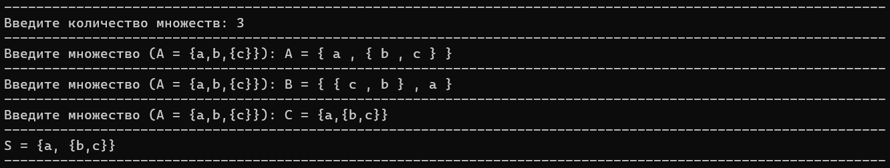

## Лабораторная работа №2
### Автор: Сечейко Николай, гр.421702
## Вариант 11

## Содержание

- [*Термины*](#термины)
- [*Введение*](#введение)
  - [*Цели и задачи*](#цели-и-задачи)
  - [*Вариант*](#вариант)
- [*Алгоритм*](#алгоритм)
  - [*Удаление элементов по краям*](#удаление-элементов-по-краям)
  - [*Разбиение элементов с учётом вложенности*](#разбиение-элементов-с-учётом-вложенности)
  - [*Нормализация элементов множеств*](#нормализация-элементов-множеств)
  - [*Подсчёт нормализованных элементов*](#подсчёт-нормализованных-элементов)
  - [*Тело алгоритма*](#тело-алгоритма)
- [*Тесты работы алгоритма*](#тесты-работы-алгоритма)
- [*Вывод*](#вывод)
- [*Список литературы*](#список-литературы)

## Термины

- **Объединением неориентированных множеств A и B без учёта повторов** - множество S, в которое входит каждый элемент, если он есть хотя бы в одном из A или B. При этом один и тот же элемент включается не более одного раза.

- **Неориентированное множество** - это множество, в котором порядок элементов не имеет значения, и дублирующиеся элементы могут учитываться (в зависимости от контекста), но не задают направление или структуру.


## Введение

### Цели и задачи

- Обеспечить ввод множеств в текстовом виде с возможностью вложенности.
- Реализовать корректный парсинг и нормализацию элементов, включая сортировку элементов во вложенных множествах.
- Реализовать учёт кратных вхождений элементов в каждом множестве.
- Построить пересечение всех множеств, учитывая количество вхождений каждого элемента.
- Вывести итоговое множество в стандартном формате, включая повторяющиеся элементы.
- Реализовать Google Tests.

### Вариант

В данной лабораторной работе представлено решение 11 варианта из [методички](https://drive.google.com/drive/folders/1_xy849HXgTDetxSMlFd0KikTBo8-xalN).
_Условие_: Реализовать программу, формирующую множество равное пересечению произвольного
количества исходных множеств (с учётом кратных вхождений элементов).

## Алгоритм

Алгоритм запрашивает у пользователя количество множеств, затем последовательно считывает каждое множество в виде строки, парсит его на элементы с учётом вложенных структур, нормализует элементы (вложенные множества сортируются), и подсчитывает их количество. Для каждого нового множества строится частотная таблица, которая затем пересекается с общей — берётся минимальное количество вхождений каждого элемента. В результате формируется итоговое множество, содержащее элементы, присутствующие во всех множествах, с учётом кратности.

### Удаление элементов по краям

```c++
string trim(const string& s) {
    size_t f = s.find_first_not_of(" \t");
    if (f == string::npos) return "";
    size_t l = s.find_last_not_of(" \t");
    return s.substr(f, l - f + 1);
}
```
Удаляет пробелы и табуляции в начале и в конце строки. Используется для очистки элементов множества от лишних символов перед сравнением или сортировкой.

### Разбиение элементов с учётом вложенности

```c++
vector<string> split_elements(const string& src) {
    vector<string> el;
    string buf;
    int depth_brace = 0, depth_angle = 0;

    for (char ch : src) {
        if (ch == '{') ++depth_brace;
        if (ch == '}') --depth_brace;
        if (ch == '<') ++depth_angle;
        if (ch == '>') --depth_angle;

        if (ch == ',' && depth_brace == 0 && depth_angle == 0) {
            if (!buf.empty()) { el.push_back(trim(buf)); buf.clear(); }
        }
        else buf += ch;
    }
    if (!buf.empty()) el.push_back(trim(buf));
    return el;
}
```

Разбивает строку на элементы множества по запятой, но только если запятая не находится внутри вложенных фигурных {} или угловых <> скобок. Это позволяет корректно обрабатывать структуры с вложенными множествами.

### Нормализация элементов множеств

```c++
string normalize_element(const string& s) {
    string t = trim(s);
    if (t.size() >= 2 && t.front() == '{' && t.back() == '}') {
        string inner = t.substr(1, t.size() - 2);
        vector<string> items = split_elements(inner);
        for (string& x : items) x = trim(x);
        sort(items.begin(), items.end());
        string res = "{";
        for (size_t i = 0; i < items.size(); ++i) {
            if (i > 0) res += ",";
            res += items[i];
        }
        res += "}";
        return res;
    }
    return t;
}
```

Если элемент — это множество в фигурных скобках, извлекает его содержимое, разделяет на подэлементы, очищает их от пробелов, сортирует и собирает обратно. Это нужно для стандартизации формы представления множеств и их корректного сравнения.

### Подсчёт нормализованных элементов

```c++
void collect_elements(const string& src, map<string, int>& out) {
    string norm = normalize_element(src);
    if (!norm.empty()) ++out[norm];
}
```

Нормализует переданный элемент и увеличивает счётчик его вхождений в словарь. Применяется при анализе каждого множества для построения частотной таблицы.

### Интерсекция нормализованных неориентированных множеств.

```c++
map<string, int> intersect_sets(const vector<string>& inputs) {
    map<string, int> common;

    for (size_t i = 0; i < inputs.size(); ++i) {
        map<string, int> current;
        vector<string> top = split_elements(inputs[i]);
        for (const string& el : top)
            collect_elements(el, current);

        if (i == 0)
            common = current;
        else {
            map<string, int> tmp;
            for (auto& p : common) {
                if (current.count(p.first))
                    tmp[p.first] = min(p.second, current[p.first]);
            }
            common.swap(tmp);
        }
    }
    return common;
}
```

Функция intersect_sets вычисляет пересечение нескольких мультимножеств, заданных в виде строк, с учётом количества повторений каждого элемента: в результирующее множество включаются только те элементы, которые присутствуют во всех входных множествах, причём число их вхождений равно минимальному количеству среди всех. Элементы нормализуются (например, {b,a} преобразуется в {a,b}), что позволяет корректно обрабатывать вложенные и неупорядоченные элементы.

### Тело алгоритма

```c++
int main() {
    setlocale(LC_ALL, "ru");

    int k = 0;
    while (k <= 0) {
        wall();
        cout << "Введите количество множеств: ";
        cin >> k;
        wall();
        if (cin.fail()) { cin.clear(); cin.ignore(1000, '\n'); k = 0; }
        if (k <= 0) cout << "Ошибка: требуются положительное число.\n";
    }
    cin.ignore();

    vector<string> raw_inputs;

    for (int i = 0; i < k; ++i) {
        string line;
        bool ok = false;
        while (!ok) {
            cout << "Введите множество (A = {a,b,{c}}): ";
            getline(cin, line);
            wall();
            size_t eq = line.find('='), l = line.find('{'), r = line.rfind('}');
            ok = (eq != string::npos && l != string::npos && r != string::npos && r > l);
            if (!ok) cout << "Ошибка формата.\n";
        }

        string inside = line.substr(line.find('{') + 1,
            line.rfind('}') - line.find('{') - 1);
        raw_inputs.push_back(inside);
    }

    map<string, int> common = intersect_sets(raw_inputs);

    if (common.empty()) cout << "S = ∅\n";
    else {
        cout << "S = {";
        bool first = true;
        for (auto& p : common)
            for (int c = 0; c < p.second; ++c) {
                if (!first) cout << ", ";
                cout << p.first;
                first = false;
            }
        cout << "}\n";
    }
    wall();
    return 0;
}
```

Функция main реализует консольное взаимодействие с пользователем для вычисления пересечения нескольких множеств: сначала запрашивается положительное целое число k — количество множеств, затем последовательно вводятся k строк в формате A = {элементы}, при этом проверяется корректность ввода (наличие =, {, } и правильная структура). Из каждой строки извлекается содержимое скобок и сохраняется в вектор raw_inputs. Далее вызывается intersect_sets, которая возвращает пересечение нормализованных мультимножеств, и результат выводится в формате множества, либо как ∅, если пересечение пустое.

## Тесты работы алгоритма

### Тест №1 (Без Google Tests)


### Тест №1 (Google Tests)


### Тест №2 (Без Google Tests)


### Тест №2 (Google Tests)


### Тест №3 (Без Google Tests)


### Тест №3 (Google Tests)


### Тест №4 (Без Google Tests)



### Тест №4 (Google Tests)


### Тест №5 (Без Google Tests)


### Тест №5 (Google Tests)


### Результаты Google Tests


## Вывод

Программа корректно реализует пересечение произвольного количества множеств с учётом кратности вхождения элементов и поддержкой вложенных структур. Все основные функции — разбор строки, нормализация вложенных множеств, подсчёт и сравнение — работают стабильно и обрабатывают как простые, так и сложные случаи, включая повторения, вложенность и форматирование с пробелами. Результат выводится в стандартной форме, соответствующей математическому представлению множества. Проведённые тесты подтверждают полноту и корректность реализации.

## Список литературы

1. https://drive.google.com/drive/folders/1_xy849HXgTDetxSMlFd0KikTBo8-xalN